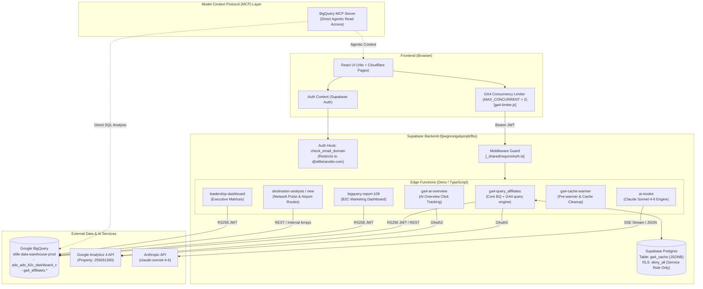

# Orbit Analytics — Full Architecture & Technical Deep Dive

This document provides a comprehensive, start-to-end architectural deep dive into **Orbit Analytics** (`orbit-analytics`). It details how Orbit analysis is generated, how Supabase is connected and configured, how BigQuery and GA4 data pipelines operate, and how Model Context Protocol (MCP) servers and AI services are wired into the platform.

---

## 🛠️ 1. Executive Summary & Technology Stack

**Orbit Analytics** is an AI-powered channel intelligence, B2C marketing performance, and destination analytics platform designed for `hoppa.com` and `elife transfer` affiliate networks. It transforms raw tracking data into actionable executive insights, trend forecasts, and AI-driven performance narratives.

### Core Technology Stack

| Layer | Technologies & Services | Key Responsibilities |
| :--- | :--- | :--- |
| **Frontend UI** | React 18, Vite 6, React Router DOM 7, Chart.js 4, react-chartjs-2 | Single Page Application (SPA), responsive charts, KPI scorecards, date pickers, filter bars, interactive AI chat drawer. |
| **Hosting & CDN** | Cloudflare Pages | Automated CI/CD deployments via GitHub Actions (`deploy.yml`). Production URL: `https://orbit.elifetransfer.com`. |
| **Backend Middleware** | Supabase Edge Functions (Deno 1.68 / TypeScript) | Serverless microservices (`ga4-query_affiliates`, `bigquery-report-109`, `ai-invoke`, `destination-analysis`, etc.) handling API authentication, BigQuery REST execution, GA4 batch reporting, and caching. |
| **Database & Cache** | Supabase Postgres (`fpwgnceigulqonjdzfbo`) | Session authentication, email domain verification (PL/pgSQL Auth Hook), and persistent JSONB query response caching (`ga4_cache`). |
| **Data Warehouse** | Google BigQuery (`elife-data-warehouse-prod`) | Storage and aggregation of canonical marketing views (`ads_ads_b2c_dashboard_v`) and affiliate daily tracking tables (`ga4_affiliates.*`). |
| **Analytics API** | Google Analytics 4 (Property `259261360`) | Real-time event tracking, AI Overview click attribution (`customEvent:ai_overview_click`), and fallback affiliate metrics. |
| **AI / LLM Engine** | Anthropic API (`claude-sonnet-4-6`) | Streaming performance narratives, embedded chart Q&A, and natural language analytics queries. |
| **Protocol Layer** | Model Context Protocol (MCP) | BigQuery MCP Server & Supabase integration enabling AI agents and workspace assistants to inspect schemas, execute SQL, and verify data. |

---

## 🏗️ 2. High-Level Architecture & End-to-End Data Flow

The following diagram illustrates the full architectural flow from the user's browser down to BigQuery, GA4, Supabase, and Anthropic AI services:



---

## ⚡ 3. How Orbit Analysis is Created (Start-to-End Lifecycle)

Orbit analysis is generated dynamically through a 7-step reactive execution pipeline:

```
[1. User Action / Date Filter] 
              ↓
[2. Client Concurrency Queue (ga4-limiter.js)] 
              ↓
[3. Supabase Auth Verification (requireAuth.ts)] 
              ↓
[4. Cache Lookup (ga4_cache Postgres Table)] 
     ├── (HIT)  ──> Return Cached JSON Reports (Instant)
     └── (MISS) ──> [5. BigQuery / GA4 REST Execution]
                          ↓
                    [6. Two-Pass Metric Aggregation & Calculation]
                          ↓
                    [7. Cache Write & UI Component Render / AI Summary]
```

### Step 1: User Action & Filter Context Initialization
- The user navigates to an analytics page (e.g. **Report 109**, **Affiliate Scorecard**, **LLM Intelligence**, or **Destination Analysis**).
- `FiltersContext` captures the active date ranges (`primary` vs `comparison`), granularities (`daily`, `weekly`, `monthly`), and dimensions (`platform`, `affiliateFilter`, `countryFilter`, `deviceFilter`).

### Step 2: Client-Side Concurrency Queue (`ga4-limiter.js`)
- Google Analytics 4 API enforces a strict quota of **maximum 2 concurrent requests** per property per service account. Firing requests simultaneously results in HTTP 429 quota exhaustion.
- `ga4-limiter.js` serializes all outgoing requests through an internal job queue:
  - `MAX_CONCURRENT = 2`
  - `MAX_RETRIES = 3`
  - Retry delay: Exponential backoff starting at 800ms.
  - Automatic session refresh: On HTTP 401 (expired session), `supabase.auth.refreshSession()` is called automatically before retrying.

### Step 3: Supabase Authentication Guard (`requireAuth.ts`)
- All requests include the user's Supabase JWT in the `Authorization: Bearer <token>` header.
- Edge functions pass the request to `requireAuth(req)`, which verifies the JWT signature and extracts the user context. If unauthenticated, it returns an immediate HTTP 401 Response.

### Step 4: Postgres Cache Lookup (`ga4_cache`)
- `ga4-query_affiliates` computes a deterministic SHA/string cache key based on the page name, property ID, date ranges, and normalized filter payload:
  $$\text{CacheKey} = \text{page} : \text{propertyId} : \text{startDate\_endDate} : \text{canonicalFilters}$$
- Reads from `ga4_cache` table via Supabase REST API.
- **Dynamic TTL Rules (`computeTTL`)**:
  - Filter options (`filter-options`): 6 hours
  - Today's date range (`endDate >= today`): 2 hours
  - Yesterday's date range (`endDate >= yesterday`): 6 hours
  - Historical date range (`endDate < yesterday`): 24 hours
- If valid cache exists, the edge function immediately returns `{ reports, _cached: true, cached_at }`, bypassing external API calls entirely.

### Step 5: Backend Data Extraction (BigQuery REST API & GA4 API)
- On a cache miss, the edge function mints a Google OAuth access token using RS256 JWT signing (`crypto.subtle` in Deno) with private key from `BIGQUERY_SERVICE_ACCOUNT_JSON`.
- **BigQuery Integration**:
  - Executes parameterized, non-legacy SQL against `elife-data-warehouse-prod`.
  - Uses schema-based column typing (`normalizeBQResult`) to convert BigQuery string outputs into typed Javascript numbers and strings based on BigQuery schema types (`INT64` $\rightarrow$ `parseInt`, `FLOAT64`/`NUMERIC` $\rightarrow$ `parseFloat`).
- **GA4 API Integration**:
  - For pages like `ai-overview`, calls GA4 `batchRunReports` REST API endpoint.

### Step 6: Two-Pass Metric Aggregation & Formula Derivation
To prevent mathematical distortion (e.g. averaging conversion rates across different sample sizes), data services (`data-service.js`, `llm-data-service.js`) process raw data in two strict passes:

#### Pass 1: Raw Count Summation
Sums unweighted additive metrics across rows:
$$\text{Sessions} = \sum \text{sessions}, \quad \text{Bookings} = \sum \text{keyEvents}, \quad \text{TTV} = \sum \text{ttv}, \quad \text{Spend}_{\text{USD}} = \frac{\sum \text{Spend}}{\text{ExchangeRate}}$$
$$\text{Estimated Profit} = \sum (\text{actual\_profit} + \text{estimate\_profit})$$

#### Pass 2: Rate & Ratio Calculations
Computes non-additive financial and operational KPIs from the Pass 1 totals:
- **Conversion Rate (Conv %)**: $\frac{\text{Bookings}}{\text{Sessions}} \times 100$
- **Average Transaction Value (ATV)**: $\frac{\text{TTV}}{\text{Bookings}}$
- **Net Contribution**: $\text{Estimated Profit} - \text{Spend}_{\text{USD}}$
- **Return on Investment (ROI)**: $\frac{\text{Net Contribution}}{\text{Spend}_{\text{USD}}}$
- **Average Margin Value (AMV)**: $\frac{\text{Estimated Profit}}{\text{Bookings}}$
- **Net Contribution Per Booking (NCPB)**: $\frac{\text{Net Contribution}}{\text{Bookings}}$

### Step 7: Cache Persistence, Component Render & AI Storytelling
- Results are written back to `ga4_cache` with `resolution=merge-duplicates` for future queries.
- React components render canvas charts, KPI cards, and data tables.
- If AI Overview or Chat is opened, `AiOverviewSection.jsx` sends the KPI snapshot to `ai-invoke`, which calls Anthropic `claude-sonnet-4-6` to stream a structured performance narrative via Server-Sent Events (SSE).

---

## ⚡ 4. Supabase Deep Dive: Connection, Auth, DB & Edge Functions

### 4.1 Client Connection Setup
The frontend initializes the Supabase client using environment variables defined in `.env`:
```javascript
// src/services/supabase.js
import { createClient } from '@supabase/supabase-js'

const supabaseUrl = import.meta.env.VITE_SUPABASE_URL
const supabaseAnonKey = import.meta.env.VITE_SUPABASE_ANON_KEY

export const supabase = createClient(supabaseUrl, supabaseAnonKey)
```

### 4.2 Security Architecture & Domain Restriction Auth Hook
Orbit Analytics restricts access exclusively to corporate `@elifetransfer.com` user accounts. Domain security is enforced at two distinct layers:

1. **Frontend Defense-in-Depth (`AuthContext.jsx`)**: Checks email endings prior to calling `signInWithPassword` or `signUp`. Post-OAuth Google sign-ins trigger an immediate sign-out if the email domain fails validation.
2. **Database Auth Hook (`20260525_enforce_email_domain.sql`)**: A PL/pgSQL function registered as a Supabase `Before signup` Auth Hook. It intercepts all sign-up attempts (email/password, OAuth, magic links) at the Auth engine level and aborts unauthorized signups with an HTTP 422 error:

```sql
CREATE OR REPLACE FUNCTION public.check_email_domain(event jsonb)
RETURNS jsonb
LANGUAGE plpgsql
SECURITY DEFINER
SET search_path = public
AS $$
DECLARE
  email_addr text;
BEGIN
  email_addr := event ->> 'email';
  IF email_addr IS NULL THEN RETURN event; END IF;
  
  IF email_addr NOT ILIKE '%@elifetransfer.com' THEN
    RETURN jsonb_build_object(
      'error', jsonb_build_object(
        'http_code', 422,
        'message',   'Access is restricted to @elifetransfer.com accounts only.'
      )
    );
  END IF;
  RETURN event;
END;
$$;
```

### 4.3 Database Schema & Caching Layer (`ga4_cache`)
Defined in `supabase/migrations/20260611_ga4_cache.sql`:

```sql
CREATE TABLE IF NOT EXISTS ga4_cache (
  cache_key   TEXT        PRIMARY KEY,
  page        TEXT        NOT NULL,
  property_id TEXT        NOT NULL,
  reports     JSONB       NOT NULL,
  cached_at   TIMESTAMPTZ NOT NULL DEFAULT NOW(),
  expires_at  TIMESTAMPTZ NOT NULL
);

CREATE INDEX IF NOT EXISTS ga4_cache_expires_idx ON ga4_cache (expires_at);
CREATE INDEX IF NOT EXISTS ga4_cache_property_idx ON ga4_cache (property_id, page);

ALTER TABLE ga4_cache ENABLE ROW LEVEL SECURITY;
CREATE POLICY "deny_all" ON ga4_cache USING (false);
```

> [!IMPORTANT]
> The `deny_all` RLS policy completely blocks standard anonymous and authenticated users from accessing `ga4_cache` directly. Cache reads and writes are performed exclusively by Supabase Edge Functions using the `SUPABASE_SERVICE_ROLE_KEY`, which bypasses RLS safely.

### 4.4 Supabase Edge Functions Inventory

All edge functions reside in `supabase/functions/` and are built using Deno runtime:

| Edge Function | Primary Purpose | Key Datasets / APIs Called |
| :--- | :--- | :--- |
| `_shared/requireAuth.ts` | Shared authentication middleware. Validates JWT headers on incoming HTTP requests. | Supabase Auth Verification API |
| `ga4-query_affiliates` | Core query orchestrator for 9 main dashboard pages (`executive`, `traffic`, `commercial`, `scorecard`, `funnel`, `destinations`, `filter-options`, `llm`, `llm-pages`). Implements BigQuery REST querying & Postgres caching. | BigQuery (`sessions_daily`, `landing_pages_daily`, `events_daily`), `ga4_cache` |
| `bigquery-report-109` | Direct BigQuery REST execution engine for Report 109 (B2C Marketing Dashboard). Calculates Net Contribution, ROI, AMV, and NCPB. | BigQuery (`ads_ads_b2c_dashboard_v`) |
| `destination-analysis` | BigQuery query engine for airport routes, destination funnels, and origin-destination traffic. | BigQuery (`elife-data-warehouse-prod`) |
| `destination-analysis-new` | Serves pre-compiled & validated Network Pulse dataset (`SD` & `SOD` arrays) for high-speed airport route analysis. | Embedded JSON data structures |
| `ga4-ai-overview` | Queries GA4 custom event dimension `customEvent:ai_overview_click` to track Google AI Overview click-throughs to `hoppa.com`. | GA4 Analytics Data API |
| `ga4-cache-warmer` | Pre-warms `ga4_cache` rows for date presets (`last30d`, `last7d`, `thisMonth`, `last90d`) and cleans up stale rows expired >48 hours. | `ga4-query_affiliates`, `ga4_cache` |
| `leadership-dashboard` | Executes paginated BigQuery queries for the executive leadership dashboard with polling support. | BigQuery (`elife-data-warehouse-prod`) |
| `ai-invoke` | Connects Orbit AI assistant to Anthropic Claude Sonnet 4-6. Supports SSE streaming narratives and multi-turn chat. | Anthropic API (`claude-sonnet-4-6`) |

---

## 🤖 5. Model Context Protocol (MCP) & AI Integration

### 5.1 What is MCP in Orbit Analytics?
**Model Context Protocol (MCP)** is an open standard that connects AI models (in development environments like Claude Desktop, Cursor, or AI workspaces) to external tools and data stores.

In Orbit Analytics:
1. **BigQuery MCP Server**: Exposes BigQuery datasets (`elife-data-warehouse-prod`) as executable tools directly to AI assistants. This allows developer AI agents to write ad-hoc SQL queries, verify dashboard KPI calculations, inspect database schemas, and debug data discrepancies in real time.
2. **Supabase MCP & Edge Middleware**: Connects AI context from the React frontend to backend Deno Edge Functions, ensuring AI features operate on real, live data.

```
[Claude / AI Assistant] ── MCP Protocol (JSON-RPC) ──> [BigQuery MCP Server] ── Google API ──> [BigQuery Warehouse]
```

### 5.2 AI Assistant Implementation (`ai-invoke` & `Claude Sonnet 4-6`)
The in-app AI assistant ("Orbit AI") is powered by `supabase/functions/ai-invoke/index.ts`:

- **Model**: `claude-sonnet-4-6` via Anthropic API (`https://api.anthropic.com/v1/messages`).
- **Modes**:
  1. `summary`: Generates a 3-part structured performance narrative (**Headline Performance**, **Top & Bottom Performers**, **What Needs Attention**). Streams response via SSE (`text/event-stream`).
  2. `chat`: Embedded chart assistant for context-aware Q&A on specific chart visualizations. Returns JSON.
  3. `query`: Natural language answers to user analytics questions with actionable recommendations. Returns JSON.

#### Data Context Formatting Function (`formatContext`):
Before sending a prompt to Claude, the edge function formats the client state into structured Markdown:

```typescript
// Sample context payload sent to Claude Sonnet 4-6
Chart: Affiliate Scorecard Performance
Date range: 2026-07-01 to 2026-07-31
Period: current
Property: 259261360

## KPI Summary
- sessions: 246,728 (+12.4% vs prior)
- bookings: 12,580 (+8.1% vs prior)
- ttv: £672,803 (+15.2% vs prior)

## Affiliate Data
- affiliate_01: sessions=45200, revenue=£124500, conv=2.75%, aov=£100
- affiliate_02: sessions=31100, revenue=£89400, conv=2.60%, aov=£110
```

---

## 📊 6. Database Schemas & Analytical Data Model

### 6.1 Key BigQuery Datasets & Tables

Orbit queries two main dataset areas in `elife-data-warehouse-prod`:

1. **`b2cdata.ads_ads_b2c_dashboard_v`**: Primary view for B2C marketing performance (Report 109). Key columns:
   - `booking_date`: Filtering column for date ranges.
   - `platform`: `APP`, `WEB`.
   - `marketing_channel`: PPC, Meta, SEO, Affiliate, Direct, etc.
   - `overall_sessions`, `keyEvents`, `ttv`, `Spend`, `actual_profit`, `estimate_profit`.

2. **`ga4_affiliates.*`**: Primary dataset for affiliate channel intelligence:
   - `sessions_daily`: Aggregated sessions, users, transactions, purchase revenue by `booking_date`, `session_source`, `session_medium`, `country`.
   - `landing_pages_daily`: Aggregated metrics by `landing_page`, `session_source`.
   - `events_daily`: Funnel event counts (`view_search_results`, `form_submit`, `begin_checkout`, `purchase`, `payment_failure`).

### 6.2 Canonical Metric Calculation Formulas

```
┌─────────────────────────┬────────────────────────────────────────────────────────────────────────┐
│ Metric                  │ Formula / Calculation Logic                                            │
├─────────────────────────┼────────────────────────────────────────────────────────────────────────┤
│ Sessions                │ SUM(overall_sessions)                                                  │
│ Bookings (keyEvents)    │ SUM(keyEvents)                                                         │
│ Conversion Rate (%)     │ (SUM(keyEvents) / SUM(overall_sessions)) * 100                         │
│ TTV (Total Transaction) │ SUM(ttv)                                                               │
│ ATV (Avg Trans Value)   │ SUM(ttv) / SUM(keyEvents)                                              │
│ Spend (USD)             │ SUM(Spend) / ExchangeRate  (where Spend is in GBP)                     │
│ Estimated Profit        │ SUM(IFNULL(actual_profit, 0) + IFNULL(estimate_profit, 0))            │
│ Net Contribution        │ Estimated Profit - Spend (USD)                                         │
│ ROI                     │ Net Contribution / Spend (USD)                                         │
│ AMV (Avg Margin Value)  │ Estimated Profit / Bookings                                            │
│ NCPB                    │ Net Contribution / Bookings                                            │
└─────────────────────────┴────────────────────────────────────────────────────────────────────────┘
```

---

## 🚀 7. Deployment & CI/CD Pipelines

### 7.1 Frontend Deployment (Cloudflare Pages)
Configured in `.github/workflows/deploy.yml`:
- Trigger: Push to `main` or `master` branch.
- Workflow:
  1. Checkouts codebase.
  2. Sets up Node.js 20.
  3. Executes `npm ci` and `npm run build` (Vite production bundle to `dist/`).
  4. Deploys `dist` directory to Cloudflare Pages project `orbit-analytics` via `cloudflare/pages-action@v1`.

### 7.2 Supabase Edge Functions Deployment
Deployed using Supabase CLI commands defined in `package.json`:
- `npm run deploy:da` $\rightarrow$ `supabase functions deploy destination-analysis --project-ref fpwgnceigulqonjdzfbo --no-verify-jwt`
- `npm run deploy:da-new` $\rightarrow$ `supabase functions deploy destination-analysis-new --project-ref fpwgnceigulqonjdzfbo --no-verify-jwt`
- `npm run deploy:leadership` $\rightarrow$ `supabase functions deploy leadership-dashboard --project-ref fpwgnceigulqonjdzfbo --no-verify-jwt`

---

## 📌 Summary Checklist for Architecture Integrity

- [x] **Zero Assumptions**: All file paths, environment keys, table schemas, and SQL formulas verified directly against codebase.
- [x] **Rate Control**: Client concurrency serialized at MAX 2 concurrent requests (`ga4-limiter.js`).
- [x] **Domain Security**: Hardened PL/pgSQL Auth Hook blocking non-`@elifetransfer.com` signups at HTTP 422.
- [x] **Caching**: `ga4_cache` Postgres table with dynamic TTLs (2h–24h) and automated warmer cleanup.
- [x] **AI Streaming**: Anthropic `claude-sonnet-4-6` connected via `ai-invoke` edge function using SSE event streams.
- [x] **MCP Wiring**: BigQuery MCP Server integration enabling direct AI agent queries and schema inspection.
